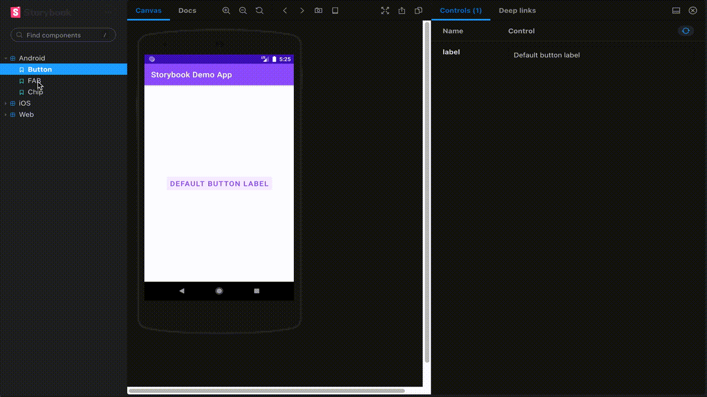
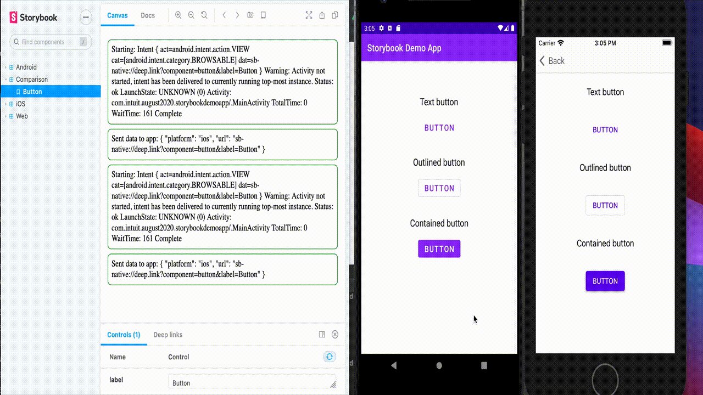

# Storybook Native
<!-- ALL-CONTRIBUTORS-BADGE:START - Do not remove or modify this section -->

<!-- ALL-CONTRIBUTORS-BADGE:END -->

Storybook Native is an extension of the normal web storybook that uses [appetize.io](https://appetize.io/) to render your mobile application in an emulator that can be interacted with from your browser. It allows you to use many of the features that are available in the web storybook, such as addons, controls, etc.

It also supports using Storybook as a [local development environment](packages/dev-middleware) to develop Android and iOS apps/components, without the need for using appetize.io.

### Installation
Before using this, ensure that you have installed [NodeJS](https://nodejs.org/en/download/)

If you want to use this module to render an emulator as a 
React component, [follow the instructions here](packages/native-components/README.md). This is recommended if you are already familiar with React and Storybook, or if you want to use features such as addons and controls.

If you want to use this module as a build tool that generates stories from metadata, [follow the instructions here](packages/native/README.md). This is recommended if you do not want to write any React code, and you will only have to write some basic JavaScript code. If you use this package, you will not have to install any extra Storybook dependencies, as they will already be included.

## Configuring your mobile application
Before using this module, your mobile application must be set up to support switching between stories. There are detailed instructions on this [here](APP-CONFIG.md)

## Uploading your mobile application
After you have modified your application to support launch parameters or query parameters, you must upload your application to [appetize.io](https://appetize.io/). After the upload, you will receive a **public key** that can be used with Storybook Native to view and interact with your application directly from Storybook.

## Setting up Storybook
Once your application is uploaded to appetize.io, you can begin setting up Storybook Native. The details for this can be found [here](./STORYBOOK-CONFIG.md)

### Examples
Examples of how to use this module as both a build tool and as a component library can be found in the [examples folder](examples/). The `app` folder inside each example contains the source code of the application the example is for.

- [Android storybook with controls](https://storybookjs.github.io/native/@storybook/native-controls-example/index.html?path=/story/button--example)
- [Flutter storybook with controls](https://storybookjs.github.io/native/@storybook/native-flutter-example/index.html?path=/story/android--button)
- [Cross platform storybook](https://storybookjs.github.io/native/@storybook/native-cross-platform-example/index.html?path=/story/android--button)
- [iOS storybook with deep linking](https://storybookjs.github.io/native/@storybook/native-ios-example-deep-link/index.html?path=/story/button--example)

More example static storybooks can be found [here](https://storybookjs.github.io/native/)

## Local app development
Details on how to test changes that you make to your mobile application to support features such as controls can be found [here](APP-TESTING.md)

## Migrating from version 1 to version 2
A full migration guide for breaking changes can be found [here](MIGRATION.md)

## Development in this repo
 - Clone this repo
 - Run yarn to install dependencies
 - `yarn build && cd examples/flutter && yarn start`  
 - In a new tab, run `yarn build` whenever changes are made to any of the packages inside of the `packages/` folder

## Contributors ✨

Thanks goes to these wonderful people ([emoji key](https://allcontributors.org/docs/en/emoji-key)):

<!-- ALL-CONTRIBUTORS-LIST:START - Do not remove or modify this section -->
<!-- prettier-ignore-start -->
<!-- markdownlint-disable -->
<table>
  <tr>
    <td align="center"><a href="http://shilman.net/"> <b>Michael Shilman</b></a> <a href="https://github.com/storybookjs/native/commits?author=shilman" title="Documentation">📖</a></td>
    <td align="center"><a href="https://github.com/amalik2"> <b>Adil Malik</b></a> <a href="https://github.com/storybookjs/native/commits?author=amalik2" title="Code">💻</a> <a href="https://github.com/storybookjs/native/commits?author=amalik2" title="Documentation">📖</a> <a href="#example-amalik2" title="Examples">💡</a></td>
    <td align="center"><a href="https://github.com/vasikarla"> <b>Raj Vasikarla</b></a> <a href="https://github.com/storybookjs/native/commits?author=vasikarla" title="Documentation">📖</a> <a href="https://github.com/storybookjs/native/commits?author=vasikarla" title="Code">💻</a></td>
    <td align="center"><a href="https://github.com/apps/imgbot"> <b>imgbot[bot]</b></a> <a href="https://github.com/storybookjs/native/commits?author=imgbot[bot]" title="Code">💻</a></td>
  </tr>
</table>

<!-- markdownlint-restore -->
<!-- prettier-ignore-end -->

<!-- ALL-CONTRIBUTORS-LIST:END -->

This project follows the [all-contributors](https://github.com/all-contributors/all-contributors) specification. Contributions of any kind welcome!